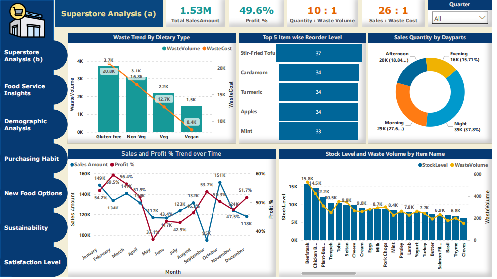
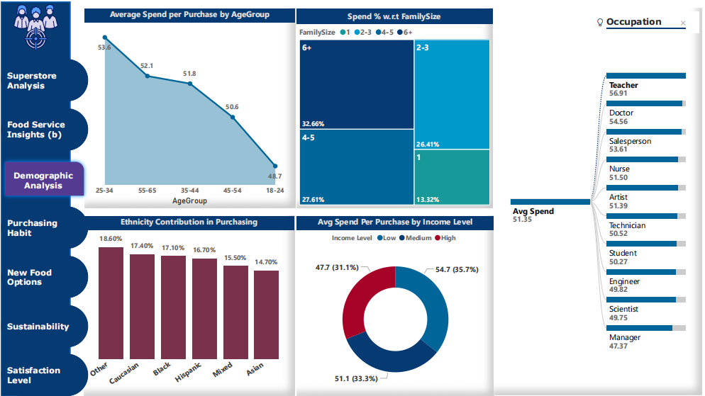

# 🛒 Superstore and Food Services Analysis : A Power BI Report

An interactive **Power BI dashboard** that provides deep insights into **superstore operations** and **food service trends**, highlighting purchasing habits, customer demographics, sustainability preferences, and satisfaction levels.

---

## 📂 Project Overview

This project transforms ERP-driven sales and survey data into a **visual analytics tool** for retail and food services.  
It enables stakeholders to explore performance by **product lines, regions, and customer segments**, and drill into habits and preferences with just a few clicks.

---

## ⚙️ Data Source & Preparation

- **Raw Data**: ERP tables and survey datasets  
- **Processing**:  
  - Connected to ERP source directly in **Power BI**  
  - Cleaned and transformed in **Power Query**  
  - Modeled relationships with **DAX measures** for KPIs (conversion rate, satisfaction, etc.)  
  - Structured navigation with drill-through functionality for in-depth analysis

---

## 🛠 Tools Used

- **ERP System** → Sales and operational data extraction  
- **Excel** → Pre-cleaning and verification of datasets  
- **Power BI** → Data modeling (**DAX**), transformation (**Power Query**), and visualization

---

## 🔑 Key Features

- **📊 Superstore Analysis** → Performance tracking by category, region, and sales trends  
- **🍴 Food Service Insights** → Demand analysis and service efficiency metrics  
- **👥 Demographics Breakdown** → Customer age, income, and regional analysis  
- **🛒 Purchasing Habits** → Buying patterns, repeat purchases, seasonal insights  
- **🥗 New Food Options** → Adoption of new product launches  
- **🌍 Sustainability Preferences** → Demand for eco-friendly and sustainable products  
- **😊 Satisfaction Levels** → Customer experience and feedback analysis

---

## 🚀 Impact

- Delivered **one-click navigation** across superstore and food service insights  
- Simplified **tracking of consumer preferences and emerging market trends**  
- Enabled **leadership and operations teams** to make data-driven decisions on products, sustainability, and satisfaction

---

## 📸 Dashboard Preview

---

